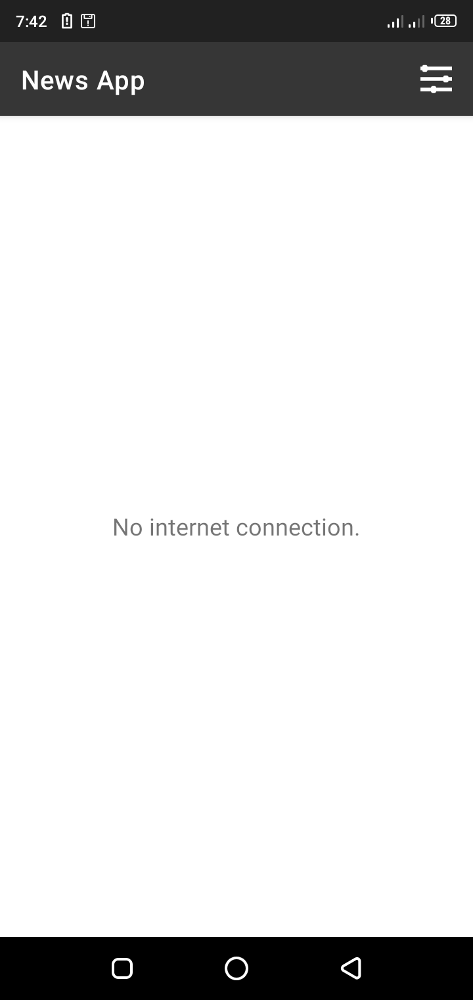
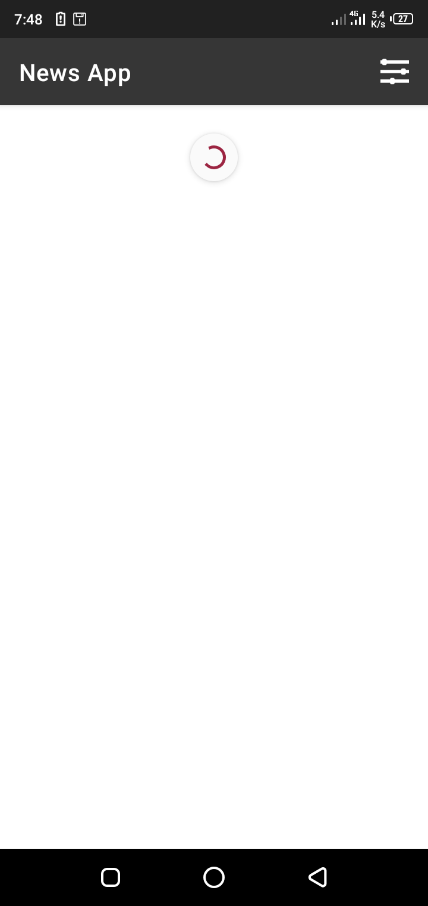
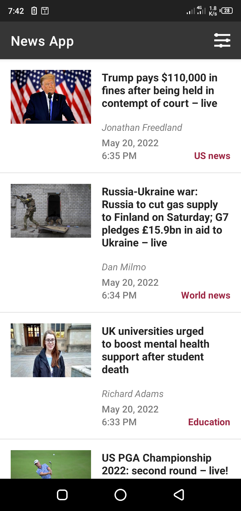
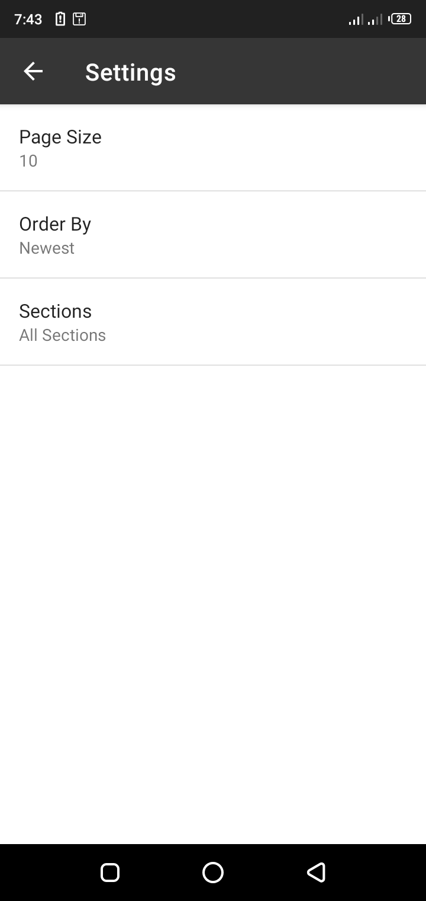

# News-App

## About
News feed App which gives users regularly updated news from the internet related to a particular topic

## Features
* Fetching data from a third-party API
* Using AsyncTaskLoader for network operations on a seperate thread
* Parsing a JSON response
* Creating a list based on a parsed JSON response and displaying it to the user
* Using a preference screen to choose the type of news fetched

## Requirements
* You need an API key from the guardian news API to use this App
* To get an API key, click [sign up for an API key](https://open-platform.theguardian.com/access)

## Instructions
* Connect to the internet and open the App
* To refresh news, swipe the screen down
* To go to Settings, click the menu options
  * Choose the number of news returned from Page Size
  * Choose the type of news returned from Sections
  * Choose how the result of the news is returned from Order By
  * Click the up navigation arrow button to refresh the changes

## App Demo

